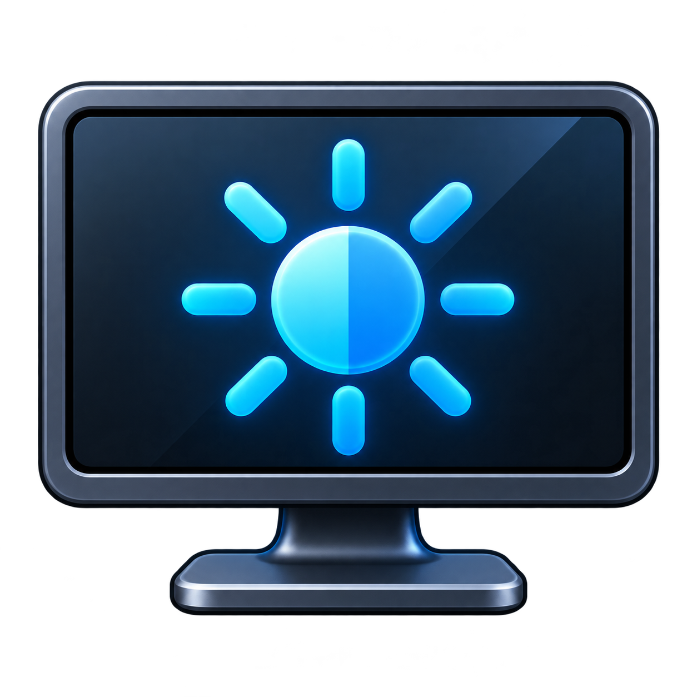

# Samsung Tizen Display Control

<p align="center">
  
</p>

<p align="center">
  <a href="#english">English</a> · <a href="#简体中文">简体中文</a>
</p>

---

<a id="english"></a>

## English

A Windows 11 tray controller for compatible Samsung Tizen displays. A companion TV application discovers the controls exposed by the current firmware and input, then presents them in a compact capability-driven flyout while keeping the HDMI picture visible through TVWindow. No on-screen Picture menu navigation is required.

> This is an unofficial community project and is not affiliated with Samsung. It relies on a local remote-control interface whose compatibility is not publicly guaranteed.

### Features

- Windows 11-style popup anchored above the system tray
- High-contrast flat television icon designed for 16×16 tray rendering
- Capability-driven picture, sound, energy, and input controls
- Absolute hardware backlight, black level, contrast, color, tint, and sharpness controls when exposed by AVInfo
- Volume and mute controls when TVAudioControl is available
- Energy-saving mode and ambient-light sensor controls
- Connected input-source selection with a second-click confirmation and automatic rollback attempt on failure
- The companion app keeps the HDMI input full-screen through `tizen.tvwindow`
- Automatically launches the Tizen bridge by application ID when the tray popup is opened
- Automatically reconnects after a temporary network interruption
- Flat sun buttons at the two ends of the backlight slider set its absolute minimum or maximum
- A slider's target value appears above its thumb only while it is being used
- Live launch, connection, adjustment, and timeout status
- Clicking outside starts a brief closing transition; the TV bridge stays ready
- The tray icon turns gray when HDMI or the TV bridge is disconnected
- Tizen pairing token encrypted with Windows DPAPI
- Single-instance protection to prevent duplicate commands

### Download

Download the self-contained Windows x64 build from [GitHub Releases](https://github.com/dttutty/samsung-m70b-brightness/releases/latest). No separate .NET installation is required for the self-contained release.

### Usage

1. Connect the PC and Samsung monitor to the same local network.
2. Start the app and enter the monitor's local IP address on first launch.
3. Install the companion Tizen bridge with a Samsung Partner certificate and launch it once.
4. If remote permission is needed, right-click the tray icon, choose **Pair TV remote permission…**, and approve that one explicit request on the monitor.
5. Left-click the television icon in the Windows system tray.
6. If the bridge is not running and a valid token is saved, the Windows app launches it automatically and waits for it to connect. A normal left-click never starts a new pairing request.
7. Use the controls reported by the connected display. Available rows can change with firmware, picture mode, and input.
8. Click anywhere outside the popup to dismiss it after a brief closing transition.

To stop the background app completely, right-click its tray icon and choose **Exit**.

The bridge reports current values whenever the popup opens, including changes made through another controller. Unsupported or read-only controls are omitted or disabled rather than guessed.

### Local data and privacy

The app stores the following files only under `%LOCALAPPDATA%\M70BBrightness`:

- `host.txt` — the monitor's local network address
- `token.dat` — the Tizen pairing token encrypted with Windows DPAPI
- `brightness.txt` — the most recently confirmed brightness value from 0 to 50

No IP address, pairing token, account credential, or brightness history is included in this repository or release package. To pair again, use **Pair TV remote permission…** in the tray icon's right-click menu.

### Verified hardware

- Samsung Smart Monitor M7 / M70B
- Model: `LS43BM702UNXZA`
- Tizen platform: 2022 `22_NIKEL_SMT`

Other Samsung displays may work when their Tizen firmware exposes TVWindow and at least one supported AVInfo/TVAudioControl method. The Windows interface is generated from the capability list returned by the display rather than hard-coded for M70B.

### Current control policy

- Verified on the tested M70B: backlight, black level, contrast, color, tint, sharpness, volume, mute, energy saving, ambient-light sensor, and input source (11 controls).
- Capability discovery is read-only. It never performs a same-value write or any other test write.
- A control is shown only when its getter works on the current firmware and input. Writes are limited to a fixed allowlist with TV-side range/enum validation.
- Input switching requires a second click, remembers the previous source, and attempts to switch back if the requested change fails or times out.
- Deliberately excluded: factory reset, picture reset, sound reset, service-menu writes, and arbitrary method execution.

### Why not use the Windows brightness slider?

The tested M70B connection does not expose a usable DDC/CI brightness VCP, and Windows `SetMonitorBrightness` fails. The native Windows brightness slider requires a brightness interface implemented by the monitor/OEM and graphics driver. A normal desktop app cannot register this local network remote-control protocol as a native Windows brightness provider.

### Build from source

Windows and the .NET 10 SDK are required:

```powershell
dotnet publish .\src\M70BBrightness\M70BBrightness.csproj -c Release -r win-x64 --self-contained false
```

The companion TV project is under `tizen/HDMIBrightnessBridge`. Before packaging it:

1. Replace the example PC address in `bridge.js` with the Windows PC's LAN IPv4 address.
2. Build it as a Samsung TV Web application in Tizen Studio.
3. Sign it with a Samsung Partner certificate containing the target display's DUID. The hidden `avinfo.color` privilege is not available to a Public certificate.
4. Rename the generated package to a short ASCII filename without spaces, such as `M70BBridge.wgt`. Some Samsung TV installers transfer a package with spaces in its filename but then fail during installation.
5. Install and launch it on the display while Developer Mode is enabled.

### Security notes

- The Windows bridge accepts companion-app connections only from the monitor address configured by the user.
- Protocol v2 uses a fixed setting allowlist. A network message cannot provide an API method name for the TV to execute.
- Numeric ranges and enum values are validated again on the TV before every write.
- Factory/picture/sound reset operations are not implemented.
- The remote-control WebSocket is used only to launch the companion Tizen application when needed.
- Samsung displays use a locally generated/self-signed certificate for this interface, so the app accepts that local TLS certificate.
- User-specific IP addresses and tokens are never compiled into the app.

---

<a id="简体中文"></a>

## 简体中文

一个用于兼容 Samsung Tizen 显示设备的 Windows 11 托盘控制器。电视端配套应用会根据当前固件与输入源实际开放的能力生成控制面板，同时通过 TVWindow 保持 HDMI 电脑画面全屏显示，不再需要反复导航 Picture 设置菜单。

> 这是非官方社区项目，与 Samsung 无关。项目使用的是未公开保证兼容性的本地遥控接口。

### 功能

- 紧贴系统托盘上方的 Windows 11 风格弹窗
- 专为 16×16 托盘尺寸设计的高对比扁平电视图标
- 按设备能力动态生成画面、声音、节能和输入源控制项
- 在 AVInfo 实际开放时，直接控制硬件背光、黑色级别、对比度、色彩、色调和锐度
- 在 TVAudioControl 可用时控制音量和静音
- 控制节能模式与环境光感应
- 输入源切换采用二次点击确认，失败时自动尝试切回原输入源
- 配套应用通过 `tizen.tvwindow` 保持 HDMI 电脑画面全屏显示
- 点击托盘弹窗时，可按应用 ID 自动启动电视端桥接器
- 局域网临时中断后自动重新连接
- 背光滑块两端的扁平太阳按钮可直接设为绝对最小/最大值
- 只在操作滑块时，才在滑块上方显示目标值
- 实时显示启动、连接、调节和超时状态
- 点击弹窗外会经过短暂收起过渡，电视端桥接器继续保持就绪
- HDMI 或电视桥接断开时，托盘图标自动变灰
- 使用 Windows DPAPI 加密保存 Tizen 配对令牌
- 单实例运行，避免多个后台进程重复发送命令

### 下载

前往 [GitHub Releases](https://github.com/dttutty/samsung-m70b-brightness/releases/latest) 下载 Windows x64 自包含版本。自包含发布包不需要额外安装 .NET。

### 使用

1. 确保电脑和 Samsung 显示器处于同一局域网。
2. 启动程序，首次运行时输入显示器的局域网 IP 地址。
3. 使用 Samsung Partner 证书安装配套 Tizen 桥接应用，并至少手动启动一次。
4. 需要遥控权限时，右键托盘图标，选择“重新配对电视遥控权限…”，然后只在这次明确发起的电视提示中选择“允许”。
5. 左键单击 Windows 系统托盘中的电视图标。
6. 如果电视端桥接器没有运行且已保存有效令牌，Windows 程序会自动启动它并等待连接。普通左键点击绝不会发起新的配对请求。
7. 使用显示器实际报告的控制项；可用项目可能随固件、画面模式和输入源变化。
8. 点击弹窗外的任意位置，弹窗会经过短暂收起过渡后隐藏。

若要完全结束后台程序，请右键托盘图标并选择“退出”。

每次打开弹窗时，桥接器都会回报当前真实值，包括由其他控制方式产生的变化。无法确认支持或只有只读能力的项目会被隐藏或禁用，不会猜测调用。

### 本机数据与隐私

程序只在 `%LOCALAPPDATA%\M70BBrightness` 保存以下文件：

- `host.txt` — 显示器局域网地址
- `token.dat` — 使用 Windows DPAPI 加密的 Tizen 配对令牌
- `brightness.txt` — 最近一次由显示器确认的亮度值，范围为 0–50

本仓库和发布包不包含任何用户 IP、配对令牌、账户凭据或亮度历史。若需重新配对，请使用托盘图标右键菜单中的“重新配对电视遥控权限…”。

### 已验证设备

- Samsung Smart Monitor M7 / M70B
- 型号：`LS43BM702UNXZA`
- Tizen 平台：2022 `22_NIKEL_SMT`

其他 Samsung Tizen 固件只要提供 TVWindow 以及至少一个受支持的 AVInfo/TVAudioControl 方法，也可能兼容。Windows 界面来自显示器返回的能力清单，并非写死为 M70B。

### 当前控制策略

- 已在测试的 M70B 上确认：背光、黑色级别、对比度、色彩、色调、锐度、音量、静音、节能模式、环境光感应和输入源，共 11 项控制能力。
- 能力发现完全只读，不执行同值写回或其他任何测试写入。
- 只有当前固件和输入源下读取成功的项目才会显示；所有写入都受固定白名单、范围与枚举值校验限制。
- 输入源切换需要二次点击确认，会记住原输入源；切换失败或超时时自动尝试切回。
- 明确排除：恢复出厂、画面重置、声音重置、Service Menu 写入与任意方法执行。

### 为什么不用 Windows 原生亮度滑块？

已测试的 M70B 连接没有暴露可用的 DDC/CI 亮度 VCP，Windows 的 `SetMonitorBrightness` 也会失败。Windows 原生亮度滑块需要显示器/OEM 与显卡驱动实现亮度接口；普通桌面应用无法把这套局域网遥控协议注册成 Windows 原生亮度提供程序。

### 从源码构建

需要 Windows 和 .NET 10 SDK：

```powershell
dotnet publish .\src\M70BBrightness\M70BBrightness.csproj -c Release -r win-x64 --self-contained false
```

电视端配套项目位于 `tizen/HDMIBrightnessBridge`。打包前需要：

1. 在 `bridge.js` 中把示例电脑地址替换为 Windows 电脑的局域网 IPv4 地址。
2. 在 Tizen Studio 中按 Samsung TV Web 应用构建。
3. 使用包含目标显示器 DUID 的 Samsung Partner 证书签名；Public 证书无法使用隐藏的 `avinfo.color` 权限。
4. 把生成的安装包改成不含空格的短 ASCII 文件名，例如 `M70BBridge.wgt`。部分 Samsung 电视会成功传输带空格文件名的包，却在安装阶段失败。
5. 在显示器开启 Developer Mode 后安装并至少启动一次。

### 安全说明

- Windows 桥接服务只接受来自用户所配置显示器地址的连接。
- 协议 v2 使用固定设置白名单，网络消息无法指定任意电视 API 方法。
- 每次写入前，电视端都会再次校验数值范围和枚举值。
- 程序没有实现恢复出厂、画面重置或声音重置。
- 遥控 WebSocket 仅用于在需要时启动配套 Tizen 应用。
- Samsung 显示器为该本地接口使用自行生成/自签名证书，因此程序会接受该本地 TLS 证书。
- 用户 IP 地址与令牌永远不会编译进程序。

---

## License / 许可证

[MIT](LICENSE)
