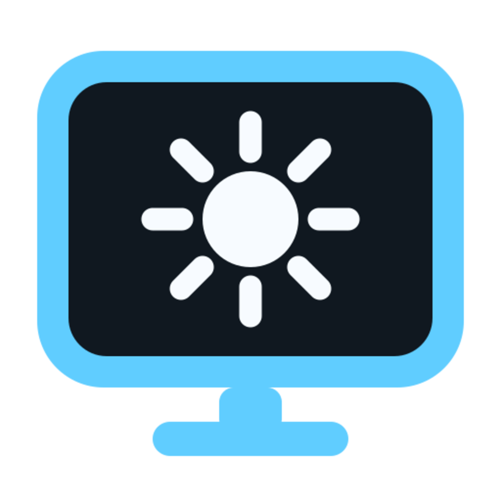
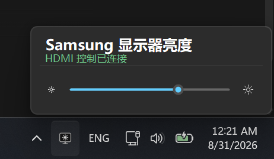

# Samsung Tizen Brightness

<p align="center">
  
</p>

<p align="center">
  <strong>English</strong> · <a href="README.zh-CN.md">简体中文</a>
</p>

A Windows 11 tray brightness controller for compatible Samsung Tizen displays. A companion TV application reads and changes the hardware backlight while keeping the HDMI picture visible through TVWindow. No on-screen Picture menu navigation is required.

<p align="center">
  
</p>

> This is an unofficial community project and is not affiliated with Samsung. It relies on a local remote-control interface whose compatibility is not publicly guaranteed.

## Features

- Windows 11-style popup anchored above the system tray
- High-contrast flat television icon designed for 16×16 tray rendering
- One deliberately focused hardware-backlight control
- The companion app keeps the HDMI input full-screen through `tizen.tvwindow`
- Automatically launches the Tizen bridge by application ID when the tray popup is opened
- Automatically reconnects after a temporary network interruption
- Flat sun buttons at the two ends of the backlight slider set its absolute minimum or maximum
- A slider's target value appears above its thumb only while it is being used
- Live launch, connection, adjustment, and timeout status
- Clicking outside starts a brief closing transition; the TV bridge stays ready
- The tray icon turns gray when HDMI or the TV bridge is disconnected
- Tizen pairing token encrypted with Windows DPAPI
- Single-instance protection to prevent duplicate commands

## Download

Download the Windows x64 build from [GitHub Releases](https://github.com/dttutty/samsung-tizen-brightness/releases/latest).

## Usage

1. Connect the PC and Samsung monitor to the same local network.
2. Start the app and enter the monitor's local IP address on first launch.
3. Install the companion Tizen bridge with a Samsung Partner certificate and launch it once.
4. If remote permission is needed, right-click the tray icon, choose **Pair TV remote permission…**, and approve that one explicit request on the monitor.
5. Left-click the television icon in the Windows system tray.
6. If the bridge is not running and a valid token is saved, the Windows app launches it automatically and waits for it to connect. A normal left-click never starts a new pairing request.
7. Drag the brightness slider, or use the sun buttons for the absolute minimum and maximum.
8. Click anywhere outside the popup to dismiss it after a brief closing transition.

To stop the background app completely, right-click its tray icon and choose **Exit**.

The bridge reports current values whenever the popup opens, including changes made through another controller. Unsupported or read-only controls are omitted or disabled rather than guessed.

## Local data and privacy

For upgrade compatibility, the app keeps using its legacy data directory at `%LOCALAPPDATA%\M70BBrightness`:

- `host.txt` — the monitor's local network address
- `token.dat` — the Tizen pairing token encrypted with Windows DPAPI
- `brightness.txt` — the most recently confirmed brightness value from 0 to 50

No IP address, pairing token, account credential, or brightness history is included in this repository or release package. To pair again, use **Pair TV remote permission…** in the tray icon's right-click menu.

## Verified hardware

- Samsung Smart Monitor M7 / M70B
- Model: `LS43BM702UNXZA`
- Tizen platform: 2022 `22_NIKEL_SMT`

Other Samsung displays may work when their Tizen firmware exposes TVWindow and the required AVInfo backlight methods. The Windows interface shows the brightness row only when the display reports that capability.

## Current control policy

- The Windows flyout intentionally exposes only hardware backlight brightness.
- Capability discovery is read-only. It never performs a same-value write or any other test write.
- Brightness is shown only when its getter works on the current firmware and input. Writes are range-validated again on the TV.
- Deliberately excluded: factory reset, picture reset, sound reset, service-menu writes, and arbitrary method execution.

## Why not use the Windows brightness slider?

The tested M70B connection does not expose a usable DDC/CI brightness VCP, and Windows `SetMonitorBrightness` fails. The native Windows brightness slider requires a brightness interface implemented by the monitor/OEM and graphics driver. A normal desktop app cannot register this local network remote-control protocol as a native Windows brightness provider.

## Build from source

Windows and the .NET 10 SDK are required:

```powershell
dotnet publish .\src\SamsungTizenBrightness\SamsungTizenBrightness.csproj -c Release -r win-x64 --self-contained false
```

The companion TV project is under `tizen/HDMIBrightnessBridge`. Before packaging it:

1. Replace the example PC address in `bridge.js` with the Windows PC's LAN IPv4 address.
2. Build it as a Samsung TV Web application in Tizen Studio.
3. Sign it with a Samsung Partner certificate containing the target display's DUID. The hidden `avinfo.color` privilege is not available to a Public certificate.
4. Rename the generated package to a short ASCII filename without spaces, such as `SamsungBrightnessBridge.wgt`. Some Samsung TV installers transfer a package with spaces in its filename but then fail during installation.
5. Install and launch it on the display while Developer Mode is enabled.

## Security notes

- The Windows bridge accepts companion-app connections only from the monitor address configured by the user.
- Protocol v2 uses a fixed setting allowlist. A network message cannot provide an API method name for the TV to execute.
- Numeric ranges and enum values are validated again on the TV before every write.
- Factory/picture/sound reset operations are not implemented.
- The remote-control WebSocket is used only to launch the companion Tizen application when needed.
- Samsung displays use a locally generated/self-signed certificate for this interface, so the app accepts that local TLS certificate.
- User-specific IP addresses and tokens are never compiled into the app.

## License

[MIT](LICENSE)
